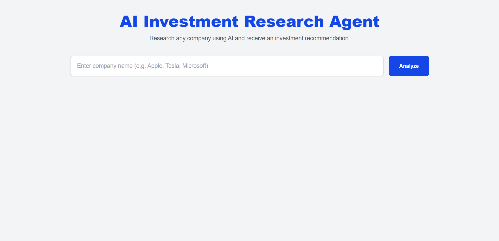
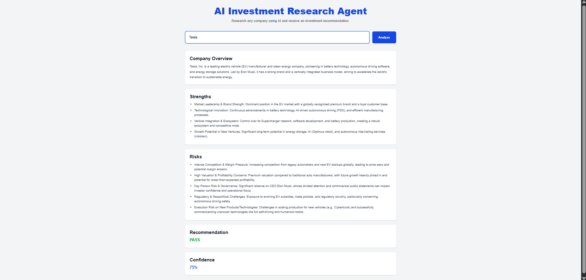

# 📈 AI Investment Research Agent

An AI-powered Investment Research Agent built using **Next.js**, **React**, **TypeScript**, **LangChain**, and **Google Gemini AI**. The application analyzes a company based on its name and generates an investment report containing an overview, strengths, risks, investment recommendation, and confidence score.

## 🚀 Live Demo

**Application:** https://ai-investment-agent-tawny.vercel.app/

**GitHub Repository:** https://github.com/<YOUR_GITHUB_USERNAME>/<YOUR_REPOSITORY_NAME>

---

## 📸 Screenshots

### 🏠 Home Page

The landing page where users can enter a company name to generate an AI-powered investment analysis.



---

### 📊 Investment Analysis

Generated investment report showing the company overview, strengths, risks, recommendation, and confidence score.



---

# 📌 Overview

The AI Investment Research Agent helps users quickly evaluate a company from an investment perspective.

A user enters a company name, and the application sends the request to a Next.js API route. The backend uses LangChain with Google's Gemini model to generate a structured investment analysis. The results are displayed in an easy-to-read dashboard.

The generated report includes:

- Company Overview
- Key Strengths
- Major Risks
- Investment Recommendation (INVEST / PASS)
- Confidence Score

---

# 🛠 Tech Stack

- Next.js 16
- React
- TypeScript
- Tailwind CSS
- LangChain
- Google Gemini AI
- Vercel

---

# ⚙️ How to Run

## 1. Clone the repository

```bash
git clone https://github.com/<YOUR_GITHUB_USERNAME>/<YOUR_REPOSITORY_NAME>.git
```

## 2. Navigate to the project

```bash
cd <YOUR_REPOSITORY_NAME>
```

## 3. Install dependencies

```bash
npm install
```

## 4. Create Environment Variables

Create a file named:

```text
.env.local
```

Add your Gemini API Key:

```env
GOOGLE_API_KEY=YOUR_GEMINI_API_KEY
```

You can generate an API key from Google AI Studio.

---

## 5. Start the development server

```bash
npm run dev
```

Open:

```
http://localhost:3000
```

---

# 🏗 How It Works

The application follows a simple AI workflow.

```
User
   │
   ▼
Search Company
   │
   ▼
Next.js Frontend
   │
   ▼
API Route (/api/analyze)
   │
   ▼
LangChain
   │
   ▼
Google Gemini
   │
   ▼
Structured JSON Response
   │
   ▼
Investment Dashboard
```

### Project Structure

```
app/
│
├── api/
│   └── analyze/
│       └── route.ts
│
├── layout.tsx
├── globals.css
└── page.tsx

components/
├── Header.tsx
├── SearchBar.tsx

lib/
├── gemini.ts
├── chain.ts
└── prompt.ts

types/
└── investment.ts
```

---

# 🧠 Key Decisions & Trade-offs

## Why Next.js?

- Built-in API Routes
- Simple deployment using Vercel
- Excellent React support

---

## Why LangChain?

LangChain simplifies interaction with the Gemini model by providing a structured interface for prompt management and AI responses.

---

## Why Gemini?

Gemini provides fast responses, strong reasoning capabilities, and integrates easily with LangChain.

---

## Why Structured JSON?

Instead of returning plain text, the model is instructed to return structured JSON.

This makes it easier to display:

- Overview
- Strengths
- Risks
- Recommendation
- Confidence Score

---

## Trade-offs

### Included

- Clean UI
- AI-powered investment analysis
- Structured responses
- Simple architecture
- Responsive design

### Left Out

To keep the project lightweight and beginner-friendly, the following features were intentionally not included:

- Live stock market data
- Financial APIs
- User authentication
- Database storage
- Historical stock charts
- Portfolio management
- News sentiment analysis

These features can be added in future versions.

---

# 📊 Example Runs

## Example 1

### Input

```
Tesla
```

### Output

**Overview**

Tesla is a leading electric vehicle and clean energy company known for innovation in automotive technology and sustainable energy solutions.

**Strengths**

- Strong global brand
- Innovation in EV technology
- Growing energy business

**Risks**

- High market valuation
- Intense competition
- Supply chain challenges

**Recommendation**

✅ INVEST

**Confidence**

75%

---

## Example 2

### Input

```
Apple
```

### Output

**Overview**

Apple is one of the world's largest technology companies with a diversified ecosystem of hardware, software, and services.

**Strengths**

- Strong ecosystem
- High customer loyalty
- Consistent revenue growth

**Risks**

- Dependence on iPhone sales
- Regulatory pressure
- Competitive market

**Recommendation**

✅ INVEST

**Confidence**

88%

---

## Example 3

### Input

```
Microsoft
```

### Output

**Overview**

Microsoft is a global technology company specializing in cloud computing, software, AI, and enterprise solutions.

**Strengths**

- Azure cloud platform
- Strong enterprise presence
- AI investments

**Risks**

- Regulatory scrutiny
- Cloud competition
- Rapid technological changes

**Recommendation**

✅ INVEST

**Confidence**

90%

---

# 🔮 Future Improvements

- Real-time stock market data
- Financial statement analysis
- Stock price visualization
- Company comparison
- Portfolio recommendations
- News sentiment analysis
- Authentication and user accounts
- Report export as PDF

---

# 👨‍💻 Author

**Vansh Arora**

B.Tech Computer Science Engineering (AI & Data Engineering)

Lovely Professional University

---

# 📄 License

This project was developed as an educational internship assignment.